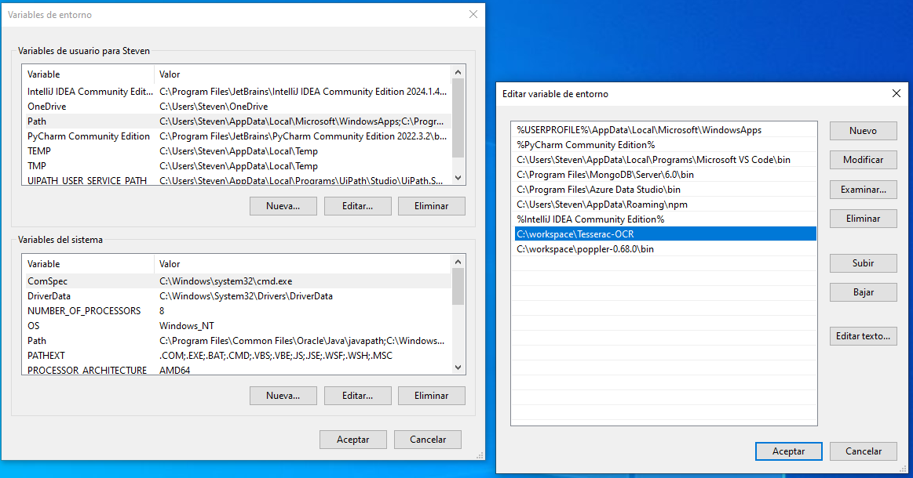

# IPA Robot Prototype for Automating Text Recognition with PyTesseract

### Overview
This prototype demonstrates the use of Optical Character Recognition (OCR) to extract text from images. It exemplifies an Intelligent Process Automation (IPA) robot designed to convert image text into actionable data. The implementation is built using Python.

### Features
- Utilizes **PyTesseract**, a powerful OCR library.
- Presented in a **Jupyter Notebook** for enhanced visualization and ease of use.

### Installation Instructions

1. **Install Tesseract-OCR**
   - Download and install Tesseract-OCR to your desired directory, for example, `C:\workspace\Tesseract-OCR`. Ensure to update the path in the code to match your installation location.
   - You can obtain the installer from [this link](https://drive.google.com/drive/folders/1cesHeiA867zEnkhjrf6mMbMsl3_r9FSl).

2. **Download and Install Poppler**
   - Download Poppler from [this link](https://drive.google.com/drive/folders/1cesHeiA867zEnkhjrf6mMbMsl3_r9FSl) and place it in a directory such as `C:\workspace\poppler-0.68.0`.

3. **Set Up Environment Variables**
   - Add the following paths to your system's environment variables:
     ```
     C:\workspace\poppler-0.68.0\bin
     C:\workspace\Tesseract-OCR
     ```
   - For visual reference, see the example configuration below:
     

### Notes
- Ensure that the paths are correctly specified both in the code and the environment variables if you modify the installation locations.
- Future updates will enhance this project to function more autonomously, transitioning from a script-based approach to a fully operational robot.

